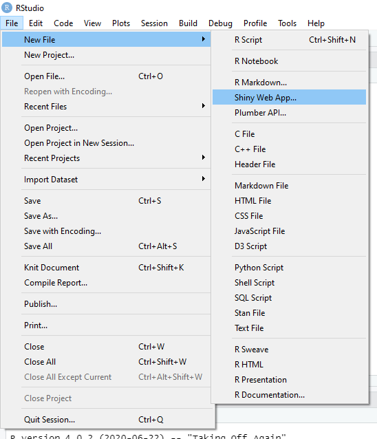
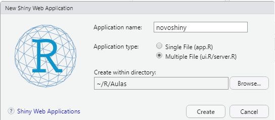
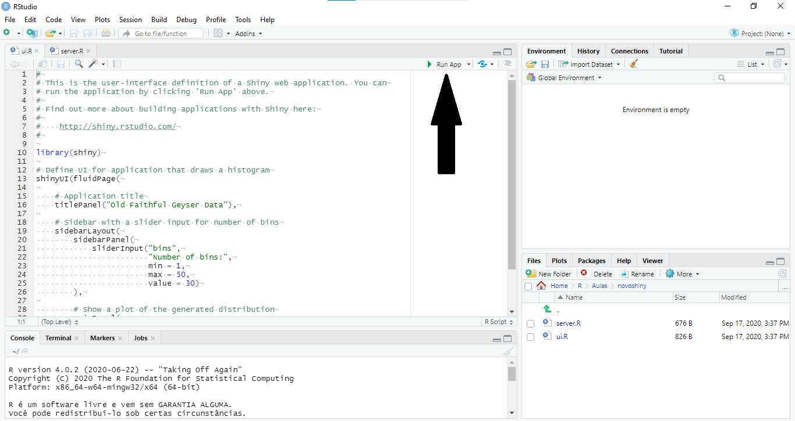
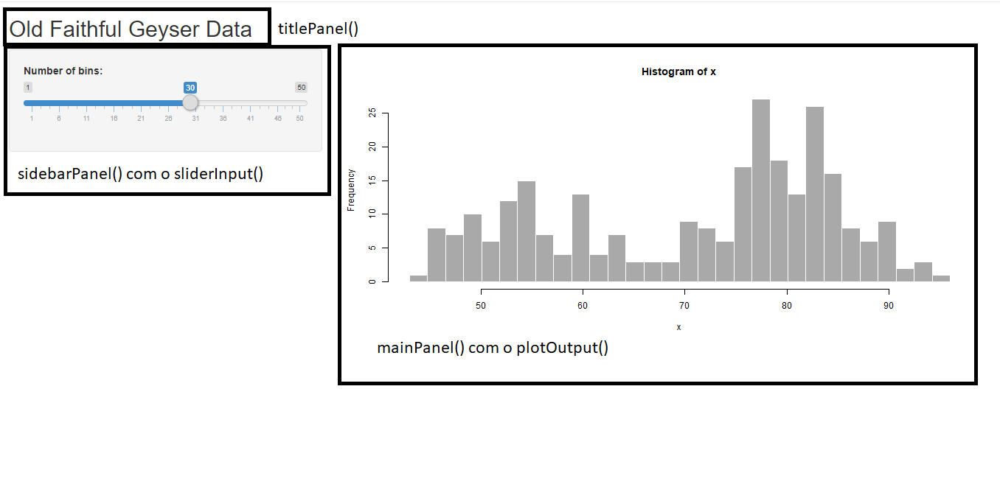

# Introdução ao Shiny {#shiny1}
## O que é shiny?

Shiny é um pacote em R que facilita a criação e desenvolvimento de web apps interativos. Com ele é possível criar sites para exploração e análise de dados, dashboards e o que mais sua imaginação permitir.

A possibilidade de transformar seu conhecimento em R, análise de dados e psicometria em insumos como um site que permite a interação do usuário com a as análises que você pretende expor, com os gráficos produzidos e tantos outros elementos vai melhorar (e muito) a qualidade do seu trabalho. Do ponto de vista de padrões de mercado, a criação de dashboards é um ativo muito valioso Por exemplo, são poucos os psicólogos capazes de realizar uma avaliação de clima organizacional com qualidade e usando técnicas modernas de análise de dados. É ainda menor o número de profissionais que conseguem entregar uma ferramenta dinâmica para que os stakeholders consigam explorar os dados obtidos durante esse processo. Se extrapolarmos a atuação para a criação de uma estratégia permanente de coleta e análise dessas informações, o número cai a quase zero.

Isto dito, seguiremos para a criação do nosso primeiro shiny.

## Meu primeiro shiny

### Primeiros passos

Para criar seu shiny, abra o RStudio, clique em "File -> New File -> Shiny Web App", conforme imagem abaixo.



Irá aparecer a sua tela um popup que pedirá algumas configurações básicas. Veja abaixo:


* Application Name:
  + Esse é o nome da aplicação. O nome que você escolherá nessa hora só servirá para organização de pastas, portanto é importante se atentar a alguns detalhes:
  + Sem caracteres especiais
  + Escolha um nome explicativo, pois depois de um tempo vai ser muito dificil encontrar um projeto que tenha um nome genérico.
* Application type:
  + Aqui voce pode escolher uma entre duas opções: Single File ou Multiple File.
  + Single File (app.R) vai gerar somente um arquivo chamado app.R. Essa é uma boa opção para shinys simples e com poucas linhas de código.
  + Multiple File (ui.R/server.R) vai gerar dois arquivos. Um que vai conter o front-end (ui.R) e um para o back-end (server.R). É a melhor opção para quem gosta de códigos bem organizados e que gosta de criar apps mais completos. Neste tutorial vamos escolher essa opção.
* Create within directory:
  + Esse é o diretório que a pasta do shiny vai ser criada. É importante que nenhum das pastas que estão acima do app tenha caracteres especiais. Isso vai fazer com que você não consiga publicar seu aplicativo com facilidade.
  


Com tudo isso em ordem, clique em "Create".

### UI e SERVER

Com o shiny criado, dois arquivos serão gerados. O arquivo `ui.R` e o arquivo `server.R`.

#### UI

UI é sigla para User Interface. Isso significa que é nesse arquivo onde os elementos que serão visualizados pelo usuário do seu shiny irão estar dispostos. Neste arquivo não vamos fazer nenhuma manipulação de dados, análises, plots ou qualquer outra coisa que o valha. Iremos somente organizar a interface para que ela possa ser apresentada ao usuário final. Você deve encontrar algo similar a esse código no arquivo recém criado:

```{r eval=FALSE}


#
# This is the user-interface definition of a Shiny web application. You can
# run the application by clicking 'Run App' above.
#
# Find out more about building applications with Shiny here:
#
#    http://shiny.rstudio.com/
#

library(shiny)

# Define UI for application that draws a histogram
shinyUI(fluidPage(

    # Application title
    titlePanel("Old Faithful Geyser Data"),

    # Sidebar with a slider input for number of bins
    sidebarLayout(
        sidebarPanel(
            sliderInput("bins",
                        "Number of bins:",
                        min = 1,
                        max = 50,
                        value = 30)
        ),

        # Show a plot of the generated distribution
        mainPanel(
            plotOutput("distPlot")
        )
    )
))
```


Nele existem alguns elementos:

* Pacotes
  + Por convenção, os pacotes são sempre carregados no início do código. Neste caso, o unico pacote carregado é o `shiny` pois ele já tem os elementos necessários para criar seu primeiro shiny.
  
* `shinyUI()`
  + Essa função que gera a interface do usuário. É dentro dela que a gente vai passar como argumentos os elementos desta interface. Os elementos seguem nesta lista
  + `fluidPage()` uma função que indica a criação de uma página flúida. Isso significa que esta página pode ser dividida em linhas e colunas. Cada linha tem largura fixa do tamanho da tela e altura alterável. Colunas existem para indicar quanto espaço horizontal dentro de um grid de 12 unidades cada elemento vai ocupar. Veremos esta disposição mais pra frente. Dentro dessa página existem outros elementos.
  + `titlePanel()` título do painel. Será apresentado no início da página.
  + `sidebarLayout()` indica que irá existir uma barra lateral e define seu layout.
  + `sidebarPanel()` indica que a barra lateral será um painel flutuante.
  + `sliderInput()` shiny widget que é composto por uma barra deslizante. Entraremos em mais detalhes do que são shiny widgets no futuro.
  + `mainPanel()` painel que fica ao lado da barra lateral. É nele que os resultados serão mostrados, caso sejam passados como argumentos.
  + `plotOutput()` indica que um gráfico está sendo gerado no servidor e que será incluído na interface de usuário onde essa função está sendo passada. Aceita o nome do plot indicado no servidor. Trataremos disto no futuro.
  
#### Server

Esse arquivo é que vai conter todo o processamento dos dados que o seu aplicativo vai fazer. Todos os cálculos, gráficos e análises ficam aqui, e são referenciados para a interface do usuário. Ao criar o seu shiny, deve encontrar uma estrutura como essa no arquivo `server.R`:

```{r eval=FALSE}
#
# This is the server logic of a Shiny web application. You can run the
# application by clicking 'Run App' above.
#
# Find out more about building applications with Shiny here:
#
#    http://shiny.rstudio.com/
#

library(shiny)

# Define server logic required to draw a histogram
shinyServer(function(input, output) {

    output$distPlot <- renderPlot({

        # generate bins based on input$bins from ui.R
        x    <- faithful[, 2]
        bins <- seq(min(x), max(x), length.out = input$bins + 1)

        # draw the histogram with the specified number of bins
        hist(x, breaks = bins, col = 'darkgray', border = 'white')

    })

})
```

Os elementos são os que seguem:

* Pacotes
  + Os pacotes sao carregados sempre no começo e fora da função `shinyServer()`. Caso coloque dentro desta função, os pacotes serão carregados sempre que houver qualquer interação do usuário com o aplicativo.
* `shinyServer()`
  + Essa função é que indica que aqui estão os elementos que compõem o backend (cálculos, plots e afins). Ela recebe alguns argumentos, dois listados abaixo e outros que não veremos neste livro.
  + input - tudo que vem da interface do usuário, capturados pelos shiny widgets. Veremos mais sobre shiny widgets no futuro.
  + output - tudo que sai do servidor e vai ser utilizado na interface do usuário. É um objeto que contém vários outros objetos.
  
A função `shinyServer()` recebe uma função dentro dela, e permite a abertura de um bloco de código, apontados pelas `{}`. Dentro dela podemos atribuir ao objeto `output` os elementos que serão apresentados na interface de usuário. O exemplo acima faz isso com o elemento distPlot. Vamos entender o que ele significa:

* `output$distPlot <-` esse código significa que o `output` vai conter um objeto chamado `distplot`. Logo em seguida existe o `<-`, que  indica atribuição de objeto.
* `renderPlot({})` esse comando indica que o que vai ficar salvo em `output$distPlot` é um plot renderizado. Ou seja, um plot que pode ser aberto em uma página da internet. Como está em um bloco de código, o exemplo atribui alguns valores e vetores a objetos e plota um histograma. Normalmente esse plot seria apresentado no proprio RStudio, mas como estamos tratando de um shiny, esse plot será enviado a interface do usuário e será apresentado onde a função `plotOutput("distPlot")` está inserida.

Ao clicar em `Run App` o seu shiny será gerado. Esse botão está nessa localização:



Ao clicar, você deve ter encontrado uma página como essa:
  


