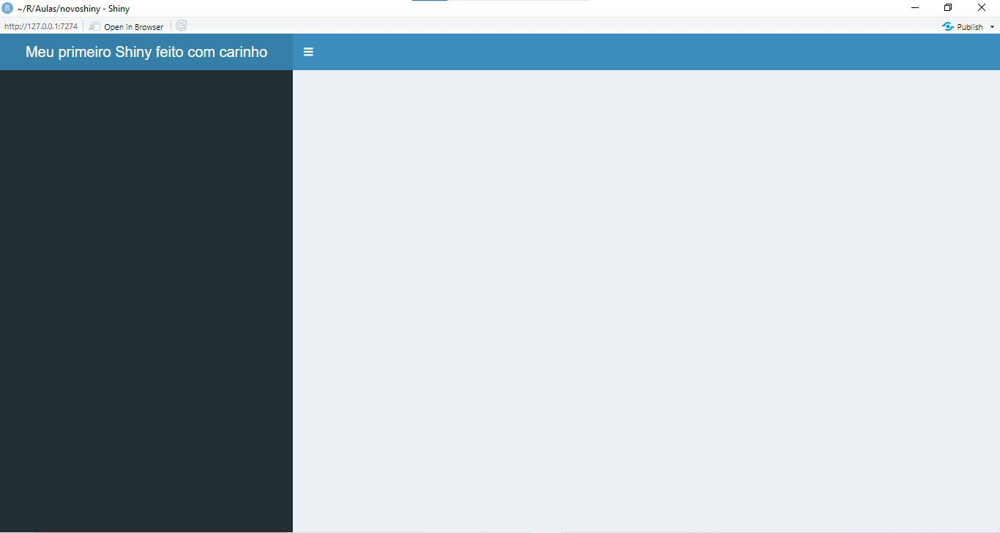

# Avançando no Shiny {#shiny2}

Agora que você já sabe o que é um shiny e como funciona sua estrutura, vamos criar nossa primeira dashboard! Esse é um modelo de visualização de dados bem aceito no mercado, o que torna esse aprendizado muito útil pra um profissional que está buscando cargos de análise de dados ou psicometria.

Antes de tudo, vamos limpar os arquivos `ui.R` e `server.R`. Já vamos inserir a estrutura que o pacote `shinydashboard` sugere.

*UI*

```{r eval = FALSE}
library(shinydashboard) # instale, caso não tenha instalado

dashboardPage(
  dashboardHeader(),
  dashboardSidebar(),
  dashboardBody()
)
```

*SERVER*

```{r}
library(shiny)

shinyServer(function(input, output) {

})
```


Ao rodar o aplicativo pelo botão `Run App` você deverá ter um shiny assim:


## Manipulando elementos do UI


### Título e sidebar

Para adicionar um título ao seu shiny, vamos passar o argumento `title = ` na função `dashboardHeader()` no `ui.R`. 

```{r eval = FALSE}
library(shinydashboard)

dashboardPage(
  dashboardHeader(
    title = 'Meu primeiro Shiny'
  ),
  dashboardSidebar(),
  dashboardBody()
)
```

O resultado será esse:


Caso você dê um título muito grande, será preciso aumentar a largura do `Header`. Para isso, passe  argumento `titleWidth = `. Ele aceita um número em pixel, como o exemplo abaixo, ou um valor em percentagem passado dentro de aspas duplas, como `titleWidth = "20%"`. Siga o exemplo abaixo.

```{r eval = FALSE}
library(shinydashboard)

dashboardPage(
  dashboardHeader(
    title = 'Meu primeiro Shiny feito com carinho',
    titleWidth = 400
  ),
  dashboardSidebar(),
  dashboardBody()
)
```

O resultado será esse: 


A largura da `sidebar` também pode ser alterada ao passar o argumento `width = ` na função `dashboardSidebar()`. Veja:

```{r eval=FALSE}
library(shinydashboard)

dashboardPage(
  dashboardHeader(
    title = 'Meu primeiro Shiny feito com carinho',
    titleWidth = 400
  ),
  dashboardSidebar(
    width = 400
  ),
  dashboardBody()
)

```




### Body

Para incluir algum elemento no corpo do shiny, basta passar como argumento dentro de `dashboardBody()`. Vamos apresentar alguns elementos de texto que podem ser úteis no futuro.

* `h1()` até `h5()`
  + Estas funções adicionam títulos, basta passar um texto entre aspas.
* `p()`
  + Função que adiciona um parágrafo.
* `br()`
  + Função que pula linha
  
Vamos testar em nosso shiny?

```{r eval=FALSE}
library(shinydashboard)

dashboardPage(
  dashboardHeader(
    title = 'Meu primeiro Shiny feito com carinho',
    titleWidth = 400
  ),
  dashboardSidebar(
    width = 400
  ),
  dashboardBody(
    h1('Título 1'),
    h3('Título 3'),
    h5('Título 5'),
    br(),
    p('Parágrafo')
  )
)
```

Veja o resultado:


Antes de seguir adiante, limpe o `ui.R` para facilitar nosso entendimento:

```{r eval=FALSE}
library(shinydashboard)

dashboardPage(
  dashboardHeader(
    title = 'Meu primeiro Shiny'
  ),
  dashboardSidebar(),
  dashboardBody()
)
```


## Ui e Server trabalhando juntos

### Tabela

Conforme foi visto no capítulo anterior, é preciso atribuir ao objeto `output` no `server` para que seja possível apresentá-lo na `ui`. Agora nós vamos aprender como apresentar tabelas no nosso shiny.

Primeiro, não esqueça de carregar os objetos que a gente precisa com o `load('bases.RData')`. Depois, nós vamos anexar ao `output` a renderização e uma tabela, com o nome de `tabela`. `renderTable()` irá preparar uma tabela normalmente apresentada no console para que possa ser apresentada no shiny. Em `renderTable()` vamos passar o dataframe `db`

Depois, vamos pedir que essa tabela seja apresentada no `ui`com `tableOutput()`. Veja como ficam os arquivos.

*UI*


```{r eval=FALSE}
library(shinydashboard)

dashboardPage(
  dashboardHeader(
    title = 'Meu primeiro Shiny'
  ),
  dashboardSidebar(),
  dashboardBody(
    tableOutput('tabela')
  )
)

```

*SERVER* 

```{r eval=FALSE}
library(shiny)

load('bases.RData') # carregamos fora da função shinyserver pra ser carregado somente uma vez

shinyServer(function(input, output) {

  output$tabela <- renderTable(db)

})

```

O resultado será esse:


### Datatable

Alguns problemas ficaram evidentes. Primeiro, que a tabela é muito grande e muito larga, o que impede sua visualização. O segundo problema é que essa tabela não ajuda muito a explração dos dados. Para tentar resolver esses problemas vamos usar a função `renderDataTable()`, com dois argumentos: a base de dados e `options =` que recebe uma lista com as opções que queremos passar. Aqui, vamos pedir que haja barra de rolagem no eixo x com `scrollX = TRUE` e limitar o máximo de observações por página a 5, com `pageLength = 5`. Também precisaremos alterar o `ui` para receber esse tipo de tabela, trocando `tableOutput()` por `dataTableOutput()`. Veja como ficam os arquivos:


```{r eval=FALSE}
library(shinydashboard)

dashboardPage(
  dashboardHeader(
    title = 'Meu primeiro Shiny'
  ),
  dashboardSidebar(),
  dashboardBody(
    dataTableOutput('tabela')
  )
)

```

*SERVER* 

```{r eval=FALSE}
library(shiny)

load('bases.RData') # carregamos fora da função shinyserver pra ser carregado somente uma vez

shinyServer(function(input, output) {

  output$tabela <- renderDataTable(
  db,
  options = list(
    scrollX = TRUE,
    pageLength = 5
  )
)

})

```

O resultado será esse:


## Menu itens

Normalmente essas dashboards sempre apresentam tipos diferentes de dados. Para isso a gente precisa organizar melhor nossa parte visual. Por enquanto vamos alterar somente o `ui.R`.

A função `dashboardSidebar()` pode receber város argumentos e outras funções. Entre elas, a função `sidebarMenu()` permite que você crie itens de menu que ao serem clicados carregam um `body` diferente. Para isso, basta chamar a função `menuItem()`, que receberá dois argumentos: O primeiro é o que estará escrito nela, e o segundo, `tabName = `, o nome que será usado para identificar esse `menuItem`.  

No entanto, para isso funcionar precisaremos passar a função `tabItens()` ao `dashboardBody()`. Essa função recebe como argumentos a função `tabItem()` que faz o link com o `meuItem()` explicado anteriormente. O primeiro argumento que ela recebe é sempre `tabName =`, que deve conter o mesmo nome identificado em `menuItem`, no argumento de mesmo nome. Após isso, trate como se fosse um `body` normal.

Veja esse exemplo:

```{r eval=FALSE}
library(shinydashboard)

dashboardPage(
  dashboardHeader(
    title = 'Meu primeiro Shiny'
  ),
  dashboardSidebar(
    sidebarMenu(
      menuItem("Base de dados", tabName = "basededados")
    )
  ),
  dashboardBody(
    tabItems(
      tabItem(
        tabName = "basededados",
        h2("Base de dados"),
        dataTableOutput('tabela')
      )
    )
  )
)
```

O resultado é esse:


Agora vamos preparar mais um menu para incluir um gráfico que iremos produzir a seguir. Crie outro `menuItem` na `sidebar` e outro `tabItem` no `body`.

```{r eval=FALSE}

library(shinydashboard)

dashboardPage(
  dashboardHeader(
    title = 'Meu primeiro Shiny'
  ),
  dashboardSidebar(
    sidebarMenu(
      menuItem('Base de dados', tabName = 'basededados'),
      menuItem('Plots', tabName = 'plots')
    )
  ),
  dashboardBody(
    tabItems(
      tabItem(
        tabName = 'basededados',
        h1('Base de dados'),
        dataTableOutput('tabela')
      ),
      tabItem(
        tabName = 'plots',
        h1('Esses são os plots')
      )
    )
  )
)

```

Explore o resultado e perceba o que acontece quando clica no item `Plots` da `sidebar`.


